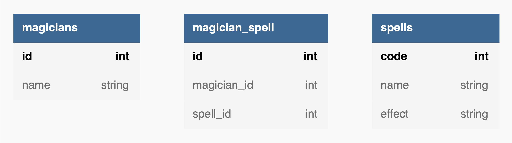

# Домашнее задание №1 ARCH
## Первое знакомство
* Поставь Tarantool.
  [Инструкция по установке](https://www.tarantool.io/ru/download/os-installation/).
* Давай для начала посмотрим на структуру базы данных, которую мы будем использовать:  
  
  На ней нет связей, вместо этого мы пишем функции, которые на сторадже собирают все необходимые данные.
* Теперь приступим к заданию. Для начала создай три спейса: `magician`, `spell`, `magician_spell`.
* Задай формат спейсов, как на картинке.
* Жирным отмечены первичные ключи, к ним нужно привязать индексы.
  Советую называть их также, как и поле. Название - это первый параметр `create_index`.
* К оставшимся полям `magician_spell` тоже нужно привязать индексы.
* Вставить трех магов, 5 заклинаний и наполнить спейс связку `magician_spell`.
  Данные для этого находятся ниже.
* Вставить трех магов, 5 заклинаний и наполнить спейс связку `magician_spell`.
  Данные для этого находятся ниже.

magician
```
{1, 'Harry'}
{2, 'Petr'}
{3, 'Gandalf'}
```

spell
```
{1, 'Lumos', 'зажигает нематериальный источник света'}
{2, 'Portus', 'открытие портала для перемещения в пространстве'}
{3, 'Reparo', 'восстанавливает сломанные предметы'}
{4, 'Levicorpus', 'подвесить противника в воздухе вниз головой'}
{5, 'Silencio', 'парализует горло противника'}
```

magician_spell
```
{1, 1, 1}
{2, 1, 2}
{3, 1, 3}
{4, 3, 1}
{5, 3, 2}
{6, 3, 3}
{7, 3, 4}
{8, 3, 5}
```

* Подготовь список магов и известных им заклинаний.
* Удали всех магов, которые не знают ни одно заклинание и верни список удаленных записей.
  Не знаю, как они попали в базу магов, но нам срочно нужно от них избавиться!
* В конце давай переименуем мага с id = 1 в 'Harry Pottor':